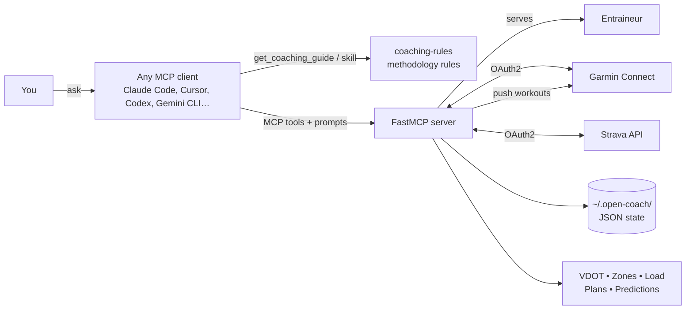

# Open Coach


> **Free and community-driven.** Open Coach is an open-source AI coach for athletes, built in the open. Contributions are welcome — coaching methodology, new watch platforms, translations, code: see [CONTRIBUTING.md](CONTRIBUTING.md).

Turn your watch into an AI-coached training stack. **Open Coach** (formerly `garmin_running_coach`) is an **MCP server** plus coaching guides that works with any MCP client — Claude Code, Claude Desktop, Cursor, Codex, Gemini CLI, VS Code… — and pulls your activities and health metrics from your watch platform (Garmin Connect today, through a pluggable provider layer) or Strava, calculates **Daniels-Gilbert VDOT** zones, monitors training load (**CTL/ATL/TSB**), generates periodized plans (**Base / Build / Peak / Taper**), and pushes structured workouts back to your watch. Coaching rules live in a methodology guide that the AI consults *before* any recommendation — so it never invents anti-patterns like back-to-back hard days or M-pace strict in week 1.

<!-- TODO: add a screen capture at docs/assets/demo.gif once recorded -->

## How it works



Two layers of intelligence:
- **`coaching-rules` skill** — coaching methodology (Daniels VDOT, 80/20, periodization, recovery, anti-patterns, DSL workout conventions). Pure rules, no I/O. Read by the AI before every coaching decision — natively as a skill in Claude Code, through the `get_coaching_guide` tool / MCP prompts everywhere else.
- **MCP server** — data plane. Pure-computation modules (`vdot.py`, `training_load.py`, `zones.py`, `plan_generator.py`, `race_predictor.py`, `recovery_monitor.py`) sit behind FastMCP tools that the AI calls. The server also sends its operating rules (read the context first, watch-sync policy, activity-analysis rules) as MCP instructions, so every client follows them.

## Requirements

- Python 3.12+
- [`uv`](https://docs.astral.sh/uv/) package manager
- Garmin Connect account
- *(optional)* Strava account + a Strava API app

## Install

```bash
uv sync
```

## Local setup after cloning

> **Windows**: the skills live in `.agents/skills/` and `.claude/skills` is a symlink to them. Run `git config --global core.symlinks true` (with Developer Mode on) **before cloning**, otherwise Claude Code sees no skills. Other clients are unaffected. Details and other limits: [`docs/mcp-clients.md`](docs/mcp-clients.md#skills-standards-followed-and-known-limits).

After installing dependencies, run the onboarding script once. It copies versioned templates into the gitignored locations the skills and hooks expect at runtime:

```bash
uv run python scripts/setup_local.py
```

This creates (if absent):
- `plans/athlete-profile.md` (your athlete profile — VDOT, race calendar, constraints, nutrition preferences) from `plans/.templates/athlete-profile.template.md`
- `plans/training-journal.md` (append-only longitudinal journal) from `plans/.templates/training-journal.template.md`
- `.claude/local/hooks.config.json` (extra trigger keywords + paths consumed by `.claude/hooks/*.py`) from `.claude/local.example/hooks.config.json`

Then edit each file with your own values. **None of these files are committed** — they live in gitignored paths so you can fork or clone the repo without inheriting someone else's training plan. See `CONTRIBUTING.md` § "Data separation policy" for the full rule.

Re-running the script is safe (idempotent — it skips files that already exist). Use `--force` to overwrite. Pass `--lang fr` to seed the athlete files from the French templates (`*.fr.template.md`) instead.

## Language

The coach works in English or French.

- **Conversation**: the coach replies in the language you write in — no setting needed.
- **Generated text** (plan markdown in `plans/`, session descriptions, plan names): set your preference once with the MCP tool `update_athlete_profile(language="en")` or `update_athlete_profile(language="fr")` — ask Claude *"set my language to French"*. Default is English.
- **Athlete templates**: `uv run python scripts/setup_local.py --lang fr` copies the French profile and journal templates; the default is English. File names are the same either way (`plans/athlete-profile.md`, `plans/training-journal.md`).
- **Plan descriptions** are parsed in both languages (`10 km incl. 15 min @ M` or `10 km dont 15 min @ M`).

## Garmin Connect setup (Garmin provider)

Set credentials as environment variables (the server will create and reuse `~/.garth/garmin_tokens.json` after the first successful login):

```bash
# bash / zsh
export GARMIN_EMAIL="you@example.com"
export GARMIN_PASSWORD="..."
```

```powershell
# Windows PowerShell (persisted at User scope)
setx GARMIN_EMAIL "you@example.com"
setx GARMIN_PASSWORD "..."
```

> **First-login warning**: Garmin's SSO is fronted by Cloudflare and rate-limits per account, not per IP. Failed attempts can lock you out for 48h+. Disable VPN/proxy/aggressive firewall and use a residential IP for the first login. If the standard flow fails, do not retry — repeated retries extend the lockout window. Install the recovery extra and run the browser-based script once (needs a local Chrome):
>
> ```bash
> uv sync --extra reauth
> uv run python scripts/garmin_re_auth.py
> ```

## Strava setup (optional)

Strava is a **read-only fallback** for activity data — handy when Garmin SSO is locked out or when you record on a non-Garmin device.

1. Create an API app at https://www.strava.com/settings/api
   - **Authorization Callback Domain**: `localhost`
   - Copy the **Client ID** and **Client Secret**

2. Set the env vars:

   ```bash
   # bash / zsh
   export STRAVA_CLIENT_ID="..."
   export STRAVA_CLIENT_SECRET="..."
   ```

   ```powershell
   # Windows PowerShell (persisted at User scope)
   setx STRAVA_CLIENT_ID "..."
   setx STRAVA_CLIENT_SECRET "..."
   ```

3. One-shot OAuth flow (opens your browser):

   ```bash
   uv run python scripts/strava_setup.py
   ```

   This listens on `http://localhost:8765/callback`, prompts you to authorize on Strava, exchanges the code, and saves tokens to `~/.open-coach/strava_tokens.json`. The server reads & auto-refreshes from there afterwards — re-run only if you revoke access.

The MCP tool `get_strava_activities(months=6, activity_type="Run")` is then live. If tokens are missing, the tool returns a hint instead of crashing.

## Drive sync (optional)

Mirror your training plan markdown across machines via Google Drive — bidirectional with the project's `plans/` directory and a one-way pull into a local Obsidian vault. No project Python; everything runs through `rclone`.

1. **Install rclone 1.66+**: `curl https://rclone.org/install.sh | sudo bash` (Linux/macOS) or `choco install rclone` (Windows). Older `apt`-shipped versions (1.60 on Ubuntu 24.04) lack the bisync flags the script needs.
2. **Configure the remote** (one-time browser OAuth):

   ```bash
   rclone config
   # New remote → name: gdrive → type: drive → scope: 1 → auto config: y
   ```

3. **Set env vars** (each machine):

   ```bash
   # bash / zsh
   export OPEN_COACH_DRIVE_FOLDER_ID="<your-drive-folder-id>"
   export OPEN_COACH_REPO_PLANS_DIR="$HOME/path/to/open-coach/plans"
   export OPEN_COACH_OBSIDIAN_PLANS_DIR="$HOME/path/to/your/obsidian/plans/folder"
   # Optional, only if your remote is not "gdrive":
   # export OPEN_COACH_DRIVE_REMOTE="my-other-name"
   ```

   ```powershell
   # Windows PowerShell (User scope; open a new shell after)
   setx OPEN_COACH_DRIVE_FOLDER_ID "<your-drive-folder-id>"
   setx OPEN_COACH_REPO_PLANS_DIR "C:\path\to\open-coach\plans"
   setx OPEN_COACH_OBSIDIAN_PLANS_DIR "C:\path\to\your\obsidian\plans\folder"
   ```

4. **Onboarding sequence** (run once, in order):

   ```bash
   bash scripts/drive_sync.sh --init-obsidian   # seed Drive from current Obsidian content
   bash scripts/drive_sync.sh --init-project    # baseline bisync state
   bash scripts/drive_sync.sh --all --dry-run   # verify steady state
   ```

5. **Daily**: `bash scripts/drive_sync.sh --all` (or `--project` / `--obsidian` separately).

> Topology: Drive is the source of truth. The project's `plans/` directory bisyncs with Drive (last mtime wins; conflicts kept as `*.conflict-*`). Obsidian is **read-only** — `--obsidian` overwrites it from Drive. Edit through the Drive web UI or the project, never directly in Obsidian.

Full setup, scheduling examples (systemd timer / Task Scheduler), and conflict/backup recovery live in [`docs/drive-sync.md`](docs/drive-sync.md).

## Run the MCP server

**Normal usage:** nothing to launch by hand. Open this repo in your MCP client and it starts the `open-coach` server from the project config shipped in the repo:

- **Claude Code** — `.mcp.json`. Approve the project-scoped server when prompted, then check with `/mcp` (should show `connected`).
- **Cursor** — `.cursor/mcp.json` (enable it in Settings → MCP).
- **Gemini CLI** — `.gemini/settings.json` (start `gemini` from the repo root).
- **Codex, VS Code, Claude Desktop, others** — one snippet each in [`docs/mcp-clients.md`](docs/mcp-clients.md). The server command is always `uv run --directory <repo> open-coach` (stdio).

**Standalone / debug only:**

```bash
uv run open-coach
```

## Quick start (after setup)

Open your MCP client in this repo and try:

- **"Analyze my last 5 runs"** — fetches recent runs, reports HR / pace / drift / anomalies
- **"Should I train hard today?"** — checks HRV, sleep, training load (CTL/ATL/TSB), returns adaptive recommendation
- **"Build me a plan for a half marathon on October 15"** — builds periodized plan (Base/Build/Peak/Taper), writes a markdown rendering to `plans/`, optionally pushes workouts to Garmin
- **"Push Tuesday's session to my watch"** — assembles a structured workout via the DSL, uploads + schedules it on Garmin Connect

Prompts work just as well in French (*"Analyse mes 5 dernières séances"*) — the coach answers in the language you use.

All workflows live in [`.agents/skills/`](.agents/skills/) (one per use case: `onboard`, `plan-training`, `push-workout`, `analyze-run`, `daily-check`, `race-ready`), next to the methodology rules in [`.agents/skills/coaching-rules/`](.agents/skills/coaching-rules/). They follow the [Agent Skills](https://agentskills.io) open standard, so Codex, Gemini CLI, Cursor, Copilot and Claude Code (through the `.claude/skills` symlink) load them natively; any other MCP client gets them from the server as `skill://` resources, MCP prompts of the same name (e.g. `/plan-training`) or the `get_coaching_guide` tool. Standards followed and known limits (Windows symlink, guide loading left to the model): [`docs/mcp-clients.md`](docs/mcp-clients.md#skills-standards-followed-and-known-limits).

For an in-depth walkthrough (architecture rationale, extension guide, FAQ), see [`docs/getting-started.md`](docs/getting-started.md).

## Dev commands

```bash
uv run pytest                         # All tests
uv run pytest tests/test_vdot.py -v   # Single file
uv run pytest -k "test_pace"          # Filter by name
uv run ruff check src/ tests/ scripts/   # Lint (same scope as CI)
uv run ruff format src/ tests/ scripts/  # Format
uv run mypy                              # Static type check (src + tests + scripts)
```

CI (GitHub Actions, [`.github/workflows/ci.yml`](.github/workflows/ci.yml)) runs `pre-commit run --all-files` (ruff check + format, mypy, personal-data audit) plus pytest on every push/PR — the exact same hooks run locally once you `pre-commit install` (pre-commit ships with the dev dependency group).

## Project layout

Selected files — not an exhaustive tree:

```
src/open_coach/
├── server.py            FastMCP entry point + lifespan (watch provider + Strava + storage)
├── strava_auth.py       Strava OAuth2 (token cache + auto-refresh)
├── strava_client.py     Thin Strava API client (urllib only)
├── vdot.py              Daniels-Gilbert VDOT engine
├── training_load.py     hrTSS + CTL/ATL/TSB
├── zones.py             Pace + HR zones from VDOT
├── workout_dsl.py       DSL + parser
├── plan_generator.py    Periodized plan generator
├── race_predictor.py    Predictions + pacing + readiness
├── recovery_monitor.py  Recovery scoring + adaptation
├── paths.py             Data dir + env vars (legacy garmin_coach names still read)
├── providers/           Watch providers: base.py (WatchProvider protocol), garmin*.py
│                        (Garmin client, OAuth2 token-cache-first, DSL → Garmin workout)
└── tools/               MCP tool modules (one per domain)

scripts/
├── strava_setup.py      One-shot Strava OAuth flow
├── drive_sync.sh        rclone bisync wrapper for plans <-> Google Drive (optional)
├── smoke_mcp.py         Live smoke test of every MCP tool/resource (real Garmin API)
├── garmin_re_auth.py    Cloudflare-resistant SSO recovery (SeleniumBase UC)
├── setup_local.py       Copy personal-data templates to gitignored locations
└── audit_docs.py        Personal-data leak + docs consistency audit
```

State persists in `~/.open-coach/` (profile, goals, plans, feedback, registries, Strava tokens).

## Privacy & data

- **All data stays local.** Garmin/Strava OAuth tokens cached at `~/.garth/` and `~/.open-coach/strava_tokens.json`. Training state (profile, goals, plans, feedback) lives in `~/.open-coach/` as plain JSON.
- **No telemetry, no third-party servers.** The MCP server speaks directly to Garmin/Strava on your behalf. The model only sees what tool calls return.
- **Athlete profile is gitignored.** Cloning the repo does NOT inherit any prior user's training plan or race calendar. Run `scripts/setup_local.py` to bootstrap your own from `plans/.templates/`.
- **No secrets in the repo.** Credentials come from env vars (`GARMIN_EMAIL`, `STRAVA_CLIENT_ID`, …). `.mcp.json` uses `${VAR:-}` interpolation, so an unset variable is passed as empty and the server starts offline.
- **Optional Google Drive sync** is opt-in, runs out of band via `rclone`, and never touches the MCP server. See [`docs/drive-sync.md`](docs/drive-sync.md).
- **Audit before every commit**: `uv run python scripts/audit_docs.py` checks that no personal-data marker leaks into versioned files. Personal markers can be added at runtime via the `OPEN_COACH_AUDIT_EXTRA_PATTERNS` env var (CSV of regex), so they never enter the repo.

## Contributing

Issues and pull requests are welcome. Start with [CONTRIBUTING.md](CONTRIBUTING.md) (setup, tests, where things go, personal-data rules) and the [Code of Conduct](CODE_OF_CONDUCT.md). First-time contributors are asked to accept the [CLA](CLA.md) once. Security problems: see [SECURITY.md](SECURITY.md).

## Author

Created and maintained by **Jonathan Cattelain** — [LinkedIn](https://www.linkedin.com/in/jonathan-cattelain/) · GitHub [@d474b3r9](https://github.com/d474b3r9).

## License

Copyright (C) 2026 Jonathan Cattelain.

Open Coach is free software under the [GNU Affero General Public License v3.0](LICENSE): use it, study it, modify it and share it. If you distribute a modified version, **or run it as a network service**, you must publish your source code under the same licence.

The project is **dual-licensed**: organisations that want to build a closed-source product or service on Open Coach can obtain a commercial licence from the maintainer — open an issue to get in touch. Commercial licences fund the project; contributions stay available to everyone under the AGPL-3.0 (see [CLA.md](CLA.md)).

The repository (code, docs, skills, templates) is written in English. The coach itself speaks English or French — see [Language](#language).
